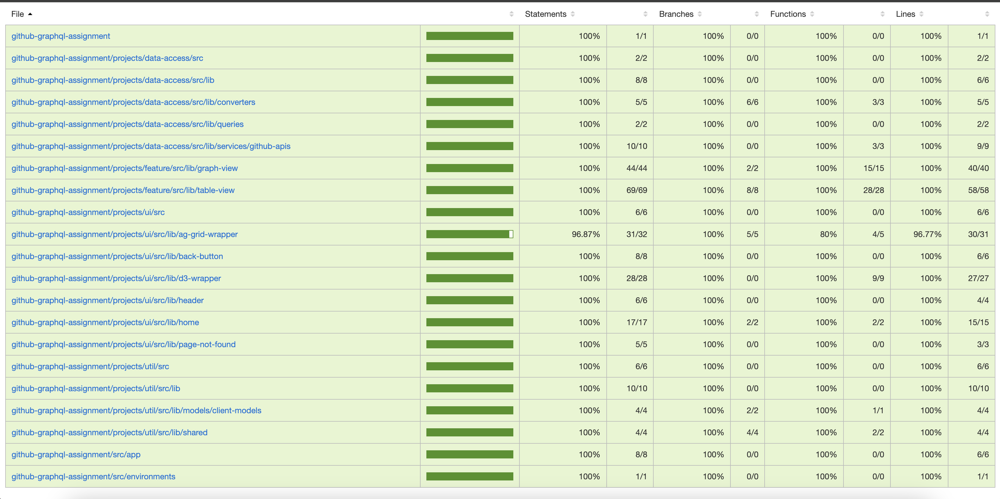
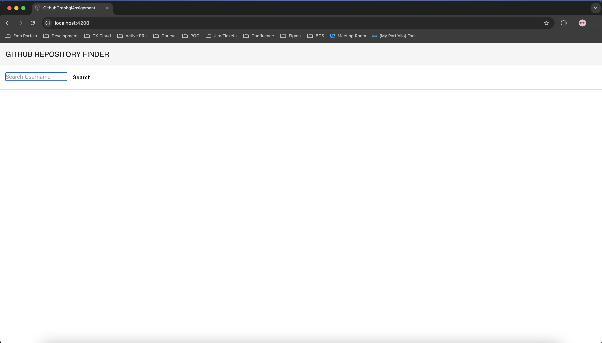
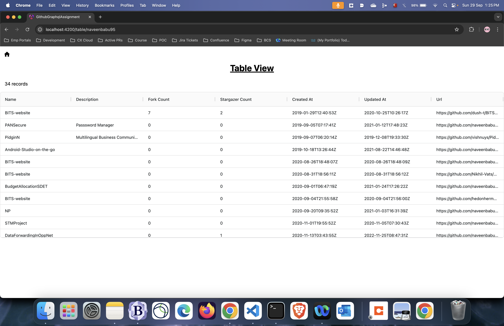
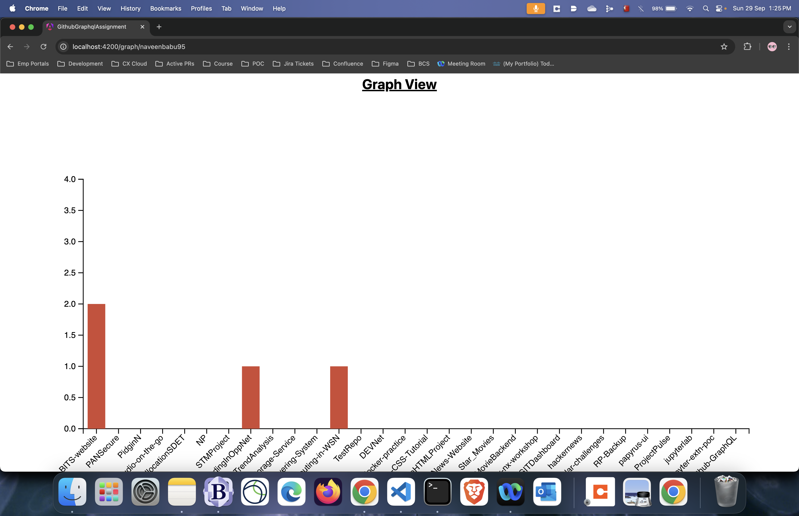

## GITHUB GRAPHQL

## Table of Contents

- [Introduction](#introduction)
- [Prerequisites](#prerequisites)
- [Installation](#installation)
- [Configuration](#configuration)
- [Running the Application](#running-the-application)

## Introduction

This is a study project. This project integrates an angular project with github graphql APIs. It searches the repos for a particular user and shows them in a table and graph format.

## Prerequisites

Ensure you have the following installed on your machine:

- [Node.js](https://nodejs.org/) (version 22) (I'm using v22.5.1)
- [Angular CLI](https://angular.io/cli)

## Installation

Follow these steps to set up the project locally:

1. **Clone the repository:**

   ```sh
   git clone git@github.com:naveenbabu95/Github-GraphQL.git
   cd Github-GraphQL
   ```

2. **Install dependencies using `npm ci`:**

   ```sh
   npm ci
   ```

   > Note:

   1. `npm ci` installs dependencies from the `package-lock.json` file, ensuring a consistent and reproducible build.
   2. if this does not work, delete the `package-lock.json` file and trying doing and npm install, this will use the existing package.json file and install dependencies in the node_modules folder

## Configuration

Replace the placeholder token in the environment file:

1. Open the environment file located at `src/environments/environment.ts`.
2. Replace the placeholder token with your actual token:

   ```typescript
   export const environment = {
     GITHUB_AUTH_TOKEN: "YOUR_ACTUAL_TOKEN_HERE",
     GITHUB_GRAPHQL_BASE_URL: "https://api.github.com/graphql",
   };
   ```

## Running the Application

To run the application locally, use the Angular CLI:

```sh
ng serve
```

## Running unit tests

Run `npm run test` to execute the unit tests

To see the coverage run the command
Run `npm run test:coverage` to see the coverage of the unit tests,
After running this command you will see a folder called coverage in the parent directory

Existing Coverage Report


Below are the screenshots from the app





